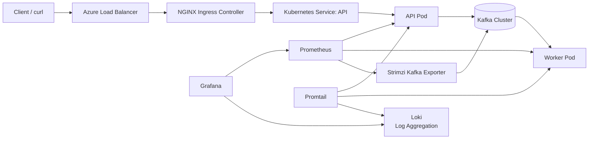
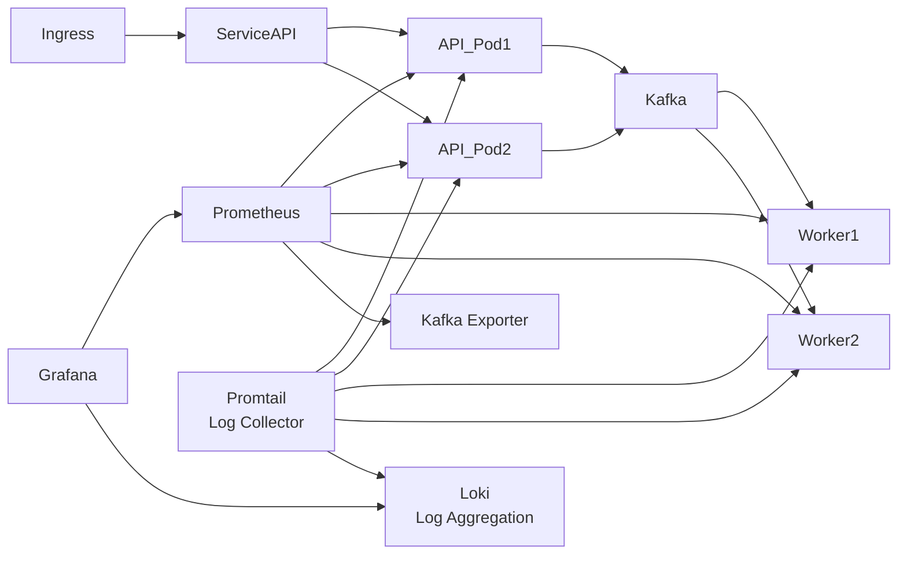
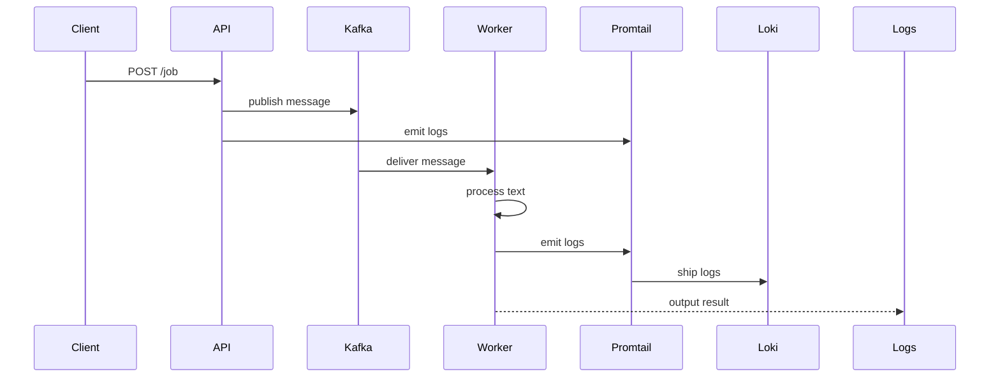

# Cloud Architecture Study

A hands-on study project demonstrating a modern cloud-native architecture built around Kubernetes, Kafka, and observability.

The system processes text messages asynchronously using an event-driven pipeline:

1. A client sends text to an API.
2. The API publishes the message to Kafka.
3. A worker service consumes the message.
4. The worker processes the text and outputs a result.

The platform includes:

- containerized microservices
- Kubernetes deployments
- Kafka messaging
- infrastructure as code
- automated observability stack
- cloud deployment on Azure

---

# Architecture

## High-Level Cloud Architecture



This diagram shows the full request path from external client to the internal application layer.

---

## Kubernetes Internal Architecture



This illustrates how services and pods interact internally inside Kubernetes.

---

## Message Processing Flow



---

# Tech Stack

| Layer | Technology |
|---|---|
| Runtime | Node.js |
| Containerization | Docker |
| Orchestration | Kubernetes |
| Messaging | Apache Kafka |
| Kafka Operator | Strimzi |
| Metrics | Prometheus |
| Logging | Loki + Promtail |
| Dashboards | Grafana |
| Ingress | NGINX Ingress Controller |
| Infrastructure | Terraform |
| Cloud | Azure Kubernetes Service |

---

# System Flow

1. Client sends text to API.
2. API publishes message to Kafka.
3. Worker consumes message from Kafka.
4. Worker processes the text payload and logs results.
5. Promtail collects logs from all services.
6. Logs are aggregated in Loki.
7. Prometheus scrapes API metrics, worker metrics, Kafka exporter metrics, and Kubernetes metrics.
8. Grafana dashboards visualize system metrics and logs.

---

# Infrastructure

Infrastructure is provisioned using Terraform.

Main components:

- Azure Kubernetes Service cluster
- Kafka cluster managed by Strimzi
- NGINX Ingress controller
- Prometheus metrics collection
- Loki log aggregation
- Grafana dashboards for metrics and logs

---

# Observability

## Metrics

Metrics can be visualized in both Grafana and Prometheus.

The current project exposes and dashboards metrics from:

- API service
- Worker service
- Kafka consumer groups through Strimzi Kafka Exporter
- Kubernetes infrastructure

Prometheus scraping is configured with ServiceMonitors for the API, worker, and Kafka exporter.

The worker exposes a dedicated HTTP observability endpoint with:

- `/metrics`
- `/health`
- `/ready`

The readiness endpoint reflects the Kafka consumer state. The worker is only ready after the consumer is connected, subscribed, and running.

The worker startup mode is configurable through `KAFKA_CONSUME_FROM_BEGINNING`:

- `false` (default): normal continuous operation. The worker joins the consumer group and continues from committed offsets.
- `true`: demo mode. The worker replays messages from the beginning of the topic, which is useful for walkthroughs and documentation examples.

Worker application metrics include:

- `jobs_processados_total`
- `jobs_falhos_total`
- `job_processing_duration_seconds`
- `kafka_consumer_connected`

The Grafana dashboard includes:

- API pod count
- Worker pod count
- Infrastructure pod count
- CPU usage
- Memory usage
- worker throughput
- worker failures
- worker processing latency
- kafka consumer lag

## Logging

Logs are collected and aggregated using Loki and Promtail:

- Promtail collects logs from pods and ships them to Loki.
- Loki aggregates logs and integrates with Grafana.
- Logs from API and Worker services are collected automatically.

---

# Running The Project

## Local Docker Compose

Use this flow for the fastest local feedback loop without Kubernetes.

Prerequisites:

- Docker with `docker compose`

Start the stack:

```bash
./scripts/environments/local/dev-up.sh
```

Stop it:

```bash
./scripts/environments/local/dev-down.sh
```

Stream logs:

```bash
./scripts/environments/local/dev-logs.sh
```

This flow exposes the API directly on `localhost:3000`, so no ingress or host mapping is required.

Send a test request:

```bash
curl http://localhost:3000/job \
  -H "Content-Type: application/json" \
  -d '{"text":"hello kafka kubernetes"}'
```

## Local Minikube / Kubernetes

Use this flow for the local setup that is closest to the Kubernetes manifests in the repository.

Prerequisites:

- Docker
- Minikube
- kubectl
- Helm
- `envsubst` from GNU `gettext`

Bootstrap the local cluster and shared platform components:

```bash
./scripts/environments/local/cluster-bootstrap.sh
```

By default this script uses the Minikube profile `minikube`.

If you prefer provisioning the local cluster with Terraform:

```bash
cd terraform/environments/local
terraform init
terraform apply
```

That Terraform flow provisions Minikube with the `cloud-study` profile and outputs the exact `docker-env` command to use.

Before deploying workloads, point Docker to the Minikube image daemon:

```bash
eval $(minikube docker-env)
```

If you used the Terraform-managed profile instead:

```bash
eval $(minikube -p cloud-study docker-env)
```

Deploy the workloads:

```bash
./scripts/environments/local/deploy.sh
```

The ingress host is `api.local`. You can either add it to `/etc/hosts` or avoid that step with `curl --resolve`.

To add the host entry:

```bash
echo "$(minikube ip) api.local" | sudo tee -a /etc/hosts
```

To test without editing `/etc/hosts`:

```bash
curl --resolve api.local:80:$(minikube ip) http://api.local/job \
  -H "Content-Type: application/json" \
  -d '{"text":"hello kafka kubernetes"}'
```

Or, if you used the Terraform-managed profile:

```bash
curl --resolve api.local:80:$(minikube ip -p cloud-study) http://api.local/job \
  -H "Content-Type: application/json" \
  -d '{"text":"hello kafka kubernetes"}'
```

The worker runs in normal continuous mode by default in Kubernetes. If you want demo behavior for walkthroughs, set `KAFKA_CONSUME_FROM_BEGINNING=true` in the worker environment before deploying.

## Cloud / AKS

Use this flow for the Azure Kubernetes Service deployment.

Prerequisites:

- Azure CLI authenticated with `az login`
- Terraform
- Docker
- kubectl
- Helm
- `envsubst` from GNU `gettext`
- Access to push images to the configured Azure Container Registry

Provision the Azure infrastructure:

```bash
cd terraform/environments/cloud
terraform init
terraform apply
```

The main cloud parameters are configurable in `terraform/environments/cloud/terraform.tfvars`:

- `cluster_name`
- `resource_group`
- `location`
- `node_count`
- `vm_size`
- `dns_prefix`
- `registry_name`

The same variables also have reasonable defaults in `terraform/environments/cloud/variables.tf`, so you can omit values that do not need customization.

Fetch AKS credentials:

```bash
az aks get-credentials --name <cluster_name> --resource-group <resource_group>
```

After `terraform apply`, you can inspect the resolved values with:

```bash
terraform output
```

Install the shared platform components:

```bash
./scripts/general/install-ingress.sh
./scripts/general/install-observability.sh
./scripts/general/install-strimzi.sh
```

Deploy the application:

```bash
./scripts/environments/azure/deploy.sh
```

The Azure deployment scripts also accept environment overrides, with defaults matching the Terraform defaults:

- `AZURE_CLUSTER_NAME`
- `AZURE_RESOURCE_GROUP`
- `AZURE_REGISTRY_NAME`
- `AZURE_REGISTRY_LOGIN_SERVER`

If you keep Terraform and script values aligned, the images will be built and pushed to the same registry created by Terraform.

The ingress manifest also uses `api.local` in AKS. For a quick test, resolve that host to the ingress external IP:

```bash
INGRESS_IP=$(kubectl get svc ingress-nginx-controller -n ingress-nginx -o jsonpath='{.status.loadBalancer.ingress[0].ip}')
curl --resolve api.local:80:${INGRESS_IP} http://api.local/job \
  -H "Content-Type: application/json" \
  -d '{"text":"hello kafka kubernetes"}'
```

---

# Project Structure

```text
.
├── docker/                 # Local docker compose setup
├── docs/                   # Architecture documentation
├── k8s/                    # Kubernetes manifests
│   ├── api/
│   ├── worker/
│   ├── kafka/
│   ├── observability/
│   ├── reliability/
│   └── apps/
├── scripts/
│   ├── environments/
│   │   ├── local/         # Local development scripts
│   │   └── azure/         # Cloud deployment scripts
│   └── general/           # Shared scripts (both local and cloud)
├── services/              # Application source code
│   ├── api/
│   └── worker/
└── terraform/             # Infrastructure as Code
    ├── environments/
    └── modules/
```

---

# Example Request

```bash
curl --resolve api.local:80:$(minikube ip) http://api.local/job \
  -H "Content-Type: application/json" \
  -d '{"text":"hello kafka kubernetes hello"}'
```

The API responds with:

```json
{
  "status": "queued",
  "message": {
    "text": "hello kafka kubernetes hello",
    "timestamp": "2024-03-16T02:00:00.000Z"
  }
}
```

The worker processes the message and logs the result (word frequency analysis):

```json
{
  "hello": 2,
  "kafka": 1,
  "kubernetes": 1
}
```

---

# Troubleshooting

- `Docker is not pointing to the Minikube image daemon`: run `eval $(minikube docker-env)` or the profile-specific command from the Terraform local outputs before `./scripts/environments/local/deploy.sh`.
- `Could not resolve host: api.local`: add `api.local` to `/etc/hosts` with the current ingress IP, or use `curl --resolve`.
- `kubectl has no current context configured`: start Minikube or fetch AKS credentials before running the Kubernetes scripts.
- `ImagePullBackOff` on AKS: confirm the images were pushed to the configured ACR and that the AKS kubelet identity can pull them.

# Future Improvements

- Dead Letter Queue (DLQ)
- Horizontal Pod Autoscaling
- Kafka-based autoscaling
- CI/CD pipeline
- Distributed tracing
